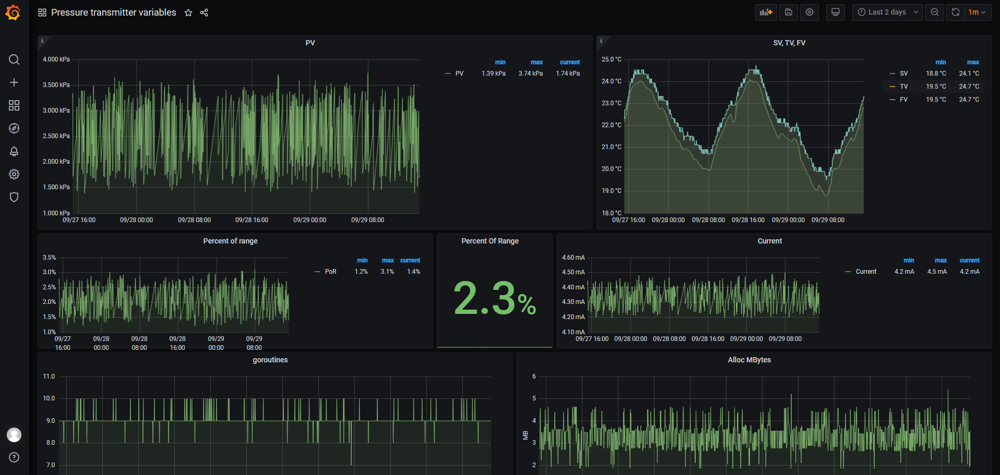

hart-exporter
=============

[Prometheus](https://prometheus.io/) exporter which retrieves device variables from a [HART](https://en.wikipedia.org/wiki/Highway_Addressable_Remote_Transducer_Protocol) transmitters and exports them  for [Prometheus](https://prometheus.io/) and [Grafana](https://grafana.com/).

In other words this is like [modbus-exporter](https://github.com/RichiH/modbus_exporter) but for [HART](https://en.wikipedia.org/wiki/Highway_Addressable_Remote_Transducer_Protocol).

Usage
-----

`hart-exporter.exe [OPTIONS]`

Options:
- `-c`  COM port name. Default "COM1"
- `-l` Listening TCP port with metrics. Default 9090
- `-d` Delay between each commands set execution in seconds. Default 10

After lunch all metrics are available at the endpoint http://localhost:9090/metrics

Dashboard example 
-----------------

Source includes example json file with Grafana dashboard:

